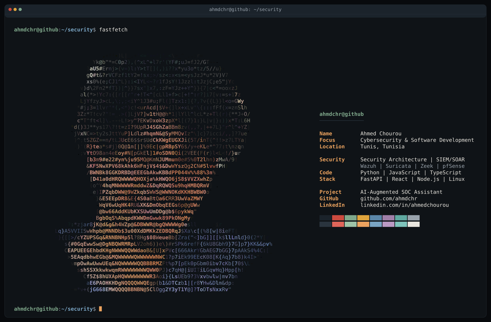

```text
ahmdchr@github
────────────────────────────────────────────────────────────────────
  Name ............. Ahmed Chourou
  Location ......... Tunis, Tunisia
  Focus ............ Cybersecurity & Software Development
  Education ........ Computer Science · MedTech / SMU
  Specialization ... Security Architecture

  ~/toolbox
  ├── languages .... Python, JavaScript, TypeScript, C/C++, Java, SQL
  ├── development .. FastAPI, React, Node.js, Express, MongoDB
  ├── defense ...... Wazuh, Suricata, Zeek, pfSense, ModSecurity
  └── foundations .. Linux, Git, OWASP, MITRE ATT&CK

  ~/selected-work
  ├── AI-Augmented SOC Assistant
  │   Suricata alerts → detection rules → local LLM analysis
  │   Python · FastAPI · SQLite · Ollama
  │
  ├── Defense-in-Depth DMZ
  │   Segmented networks, WAF, reverse proxy & honeypot
  │   Tunisie Télécom · Cybersecurity capstone
  │
  └── AI Task Management Agent
      Emails → structured tasks → calendar events
      Gemini · Microsoft Graph

  ~/community
  └── Securinets ... CTF support, workshops & training environments

  ~/connect
  ├── github ...... github.com/ahmdchr
  └── linkedin .... linkedin.com/in/ahmedchourou
────────────────────────────────────────────────────────────────────
```

[LinkedIn](https://linkedin.com/in/ahmedchourou) · [Repositories](https://github.com/ahmdchr?tab=repositories)
